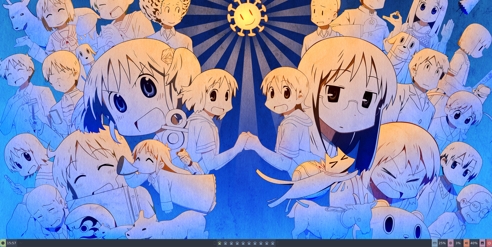
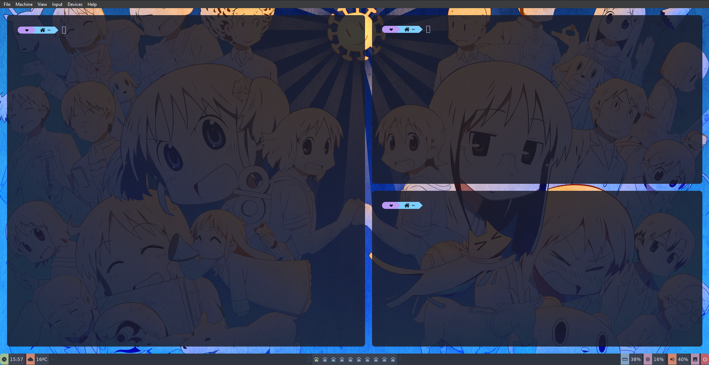
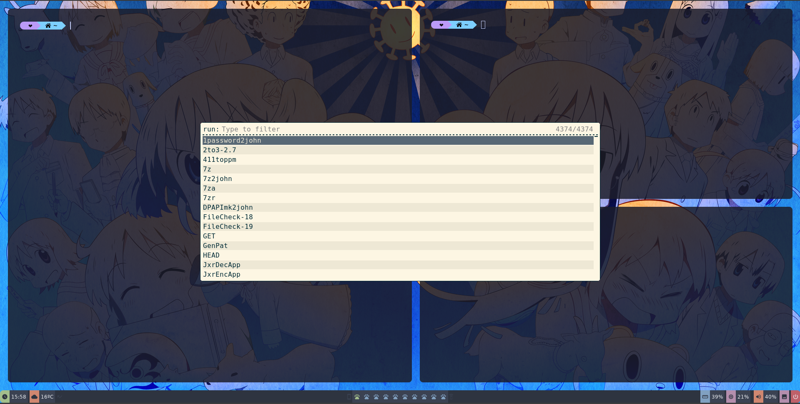
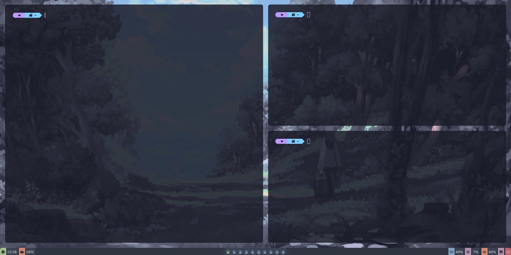
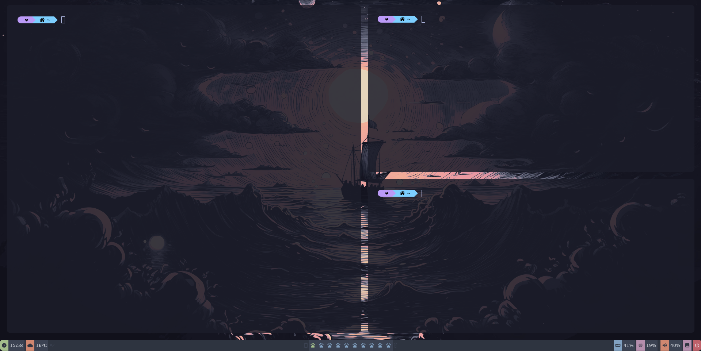
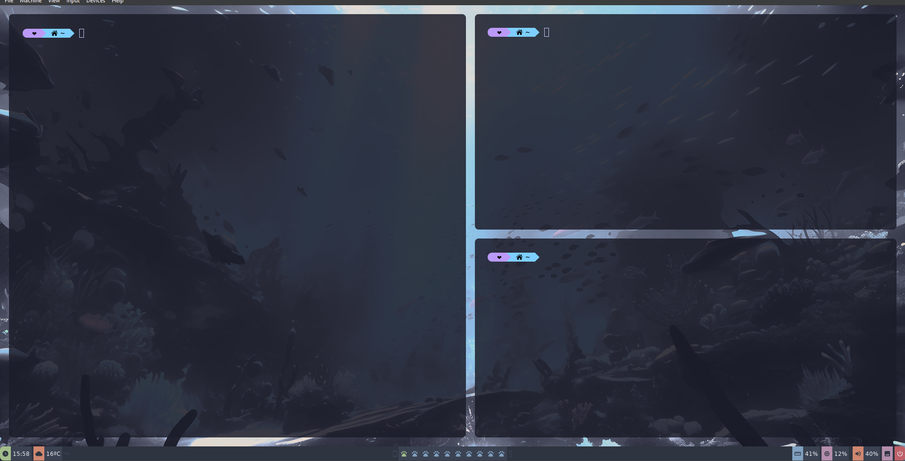

 
<a id="readme-top"></a>
 
[![Contributors][contributors-shield]][contributors-url]
[![Forks][forks-shield]][forks-url]
[![Stargazers][stars-shield]][stars-url]
[![Issues][issues-shield]][issues-url]
[![Unlicense License][license-shield]][license-url]
[![LinkedIn][linkedin-shield]][linkedin-url]


<!-- PROJECT LOGO -->
<br />
<div align="center">
  <a href="https://github.com/othneildrew/Best-README-Template">
    
  </a>

  <h3 align="center">Auto-bspwm kali linux</h3>

  <p align="center">
  bash scripts that automates bspwm window manager installation and configuration on kali linux distributions with catpuccin theme
    <br />
    <a href="https://github.com/othneildrew/Best-README-Template"><strong>Explore the docs »</strong></a>
    <br />
    <br />
    <a href="https://github.com/othneildrew/Best-README-Template">View Demo</a>
    &middot;
    <a href="https://github.com/othneildrew/Best-README-Template/issues/new?labels=bug&template=bug-report---.md">Report Bug</a>
    &middot;
    <a href="https://github.com/othneildrew/Best-README-Template/issues/new?labels=enhancement&template=feature-request---.md">Request Feature</a>
  </p>
</div>


## Images








## Quick usage
```
sudo apt-get update -y
./minimal-install.sh

```

## Software
This configuration uses the following software:
- **WM**: [bspwm](https://github.com/baskerville/bspwm)
- **Hotkey**: [sxhkd](https://github.com/baskerville/sxhkd)
- **Shell**: [zsh](https://www.zsh.org/)
- **Shell Theme**: [powerlevel10k](https://github.com/romkatv/powerlevel10k)
- **Bars**: [polybar](https://github.com/polybar/polybar)
- **Compositor**: [picom](https://github.com/yshui/picom)
- **Application Launcher**: [rofi](https://github.com/davatorium/rofi)
- **Browsers**: [firefox](https://www.mozilla.org/en-US/firefox/new/)
- **Terminals**: [kitty](https://sw.kovidgoyal.net/kitty/) 
- **Static Wallpaper**: [feh](https://github.com/derf/feh)
